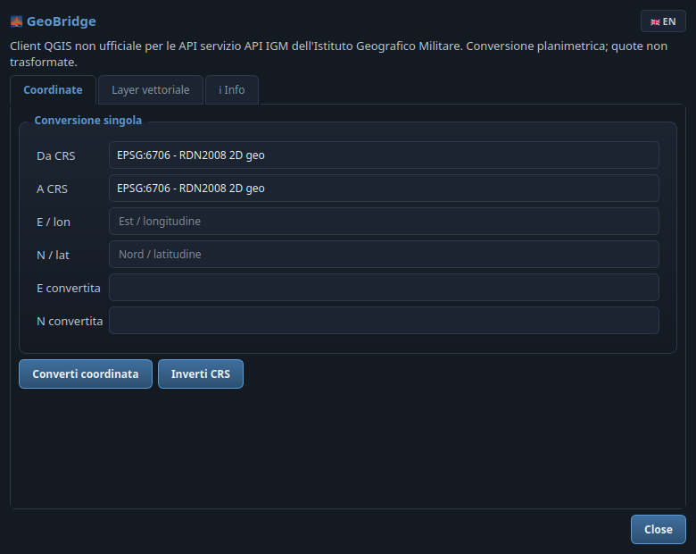

# 🌉 GeoBridge for QGIS

[](https://qgis.org/)
[](https://www.gnu.org/licenses/gpl-2.0)
[](https://www.riverbankcomputing.com/software/pyqt/)
[](https://flake8.pycqa.org/)
[]()

> **IT** · Client QGIS *non ufficiale* per il servizio **API IGM** dell'Istituto Geografico Militare: conversione planimetrica di singole coordinate e di interi layer vettoriali, direttamente da QGIS.
>
> **EN** · *Unofficial* QGIS client for the **IGM API** service of the Italian Military Geographic Institute: planimetric conversion of single coordinates and whole vector layers, directly from QGIS.

**🌐 Lingua / Language:** [🇮🇹 Italiano](#-italiano) · [🇬🇧 English](#-english)

---

## 🇮🇹 Italiano

### Cos'è
**GeoBridge** è un client QGIS *non ufficiale* per interfacciarsi con il servizio [API IGM](https://igmi.esercito.difesa.it/servizi/verto-online/) fornito dall'**Istituto Geografico Militare (IGM)**. Permette la conversione planimetrica di singole coordinate e di interi layer vettoriali direttamente dall'interfaccia di QGIS.

Supporta QGIS 3 (Qt5) e QGIS 4 (Qt6) in modo trasparente, con interfaccia bilingue italiano/inglese commutabile dal pulsante con bandiera 🇮🇹/🇬🇧 in alto a destra.

### ⚠️ Disclaimer legale e paternità (IMPORTANTE)
Questo plugin è uno strumento indipendente sviluppato da terzi (Dott. Sarino Alfonso Grande) e **NON è in alcun modo sviluppato, approvato, certificato, distribuito o garantito dall'Istituto Geografico Militare (IGM)**.

* **Servizio API IGM:** il servizio API IGM, l'infrastruttura server, le API, gli algoritmi di calcolo, il marchio istituzionale e i risultati delle elaborazioni sono e restano di **esclusiva proprietà dell'Istituto Geografico Militare**.
* **Nessuna appropriazione:** l'autore di questo plugin non si appropria né rivendica alcun diritto sui prodotti, servizi o denominazioni dell'IGM. Il plugin agisce esclusivamente come "ponte" (client) verso un endpoint pubblico.
* **Condizioni d'uso:** l'utilizzo del servizio IGM tramite questo plugin è soggetto esclusivamente alle [condizioni d'uso ufficiali pubblicate da IGM](https://igmi.esercito.difesa.it/servizi/verto-online/). L'invio di coordinate all'endpoint pubblico implica l'accettazione di tali condizioni.

Per ulteriori dettagli normativi, consultare i file `NOTICE.md` e `LEGAL_IGM_PUBLICATION_REVIEW.md` inclusi nel repository.

### ✨ Funzionalità
| | Funzionalità | Descrizione |
|---|---|---|
| 🔍 | **Recupero dinamico dei CRS** | Lettura automatica dell'elenco dei Sistemi di Riferimento supportati dal servizio IGM in tempo reale (`{"richiesta": "info"}`). |
| 📍 | **Conversione singola** | Interfaccia semplice per convertire istantaneamente le coordinate di un singolo punto. |
| 🗺️ | **Conversione layer** | Trasformazione massiva dei vertici XY di un layer vettoriale esistente, generando un nuovo layer temporaneo direttamente nel progetto. |
| 📋 | **Mantenimento attributi** | Copia fedele degli attributi dal layer sorgente al layer convertito. |
| 🌐 | **Interfaccia bilingue IT/EN** | Pulsante con bandiera 🇮🇹/🇬🇧 in alto a destra: tutta l'interfaccia cambia lingua in tempo reale. |
| 🎨 | **Tema scuro "slate blue"** | Tema scuro condiviso della famiglia di plugin SinoCloud (lo stesso di SARIAG e STAC Browser). |
| 🔗 | **Scheda Info con menù a tendina** | Nella scheda Info un menù a tendina presenta gli altri plugin dell'autore, con descrizione e link al repository GitHub. |

> **Nota tecnica:** la conversione gestita dal servizio IGM è puramente planimetrica. Eventuali valori Z/M presenti nelle geometrie non verranno trasformati.

### 📡 API utilizzata
Il plugin comunica tramite richieste HTTP POST (formato JSON) con l'endpoint ufficiale IGM:
`https://igmi.esercito.difesa.it/porta-magna/wps/volapi`

Esempio di payload generato per la conversione:
```json
{
  "richiesta": "conversione",
  "utente": "qgis",
  "chiave": "qgis",
  "inEpsg": 4265,
  "outEpsg": 6706,
  "coordinate": [
    {"e": 12.0, "n": 42.0}
  ]
}
```

### 🛠️ Installazione
1. Scaricare il repository o il pacchetto ZIP.
2. Copiare la cartella `geobridge` all'interno della directory dei plugin del profilo di QGIS:
   * **Linux:** `~/.local/share/QGIS/QGIS3/profiles/default/python/plugins/`
   * **Windows:** `%APPDATA%\QGIS\QGIS3\profiles\default\python\plugins\`
   * **macOS:** `~/Library/Application Support/QGIS/QGIS3/profiles/default/python/plugins/`
3. Aprire QGIS, andare su **Plugin → Gestisci e installa plugin…**, cercare *GeoBridge* e attivarlo spuntando la casella.

### 🚀 Utilizzo rapido
1. Apri **GeoBridge** dalla toolbar o dal menù **Vettore**.
2. Scheda **Coordinate**: scegli CRS di partenza e arrivo, inserisci E/N e premi **Converti coordinata**.
3. Scheda **Layer vettoriale**: scegli il layer, i CRS e premi **Converti layer**; il risultato è un layer temporaneo con gli stessi attributi.
4. Scheda **Info**: informativa IGM completa e menù a tendina con gli altri plugin dell'autore.

---

## 🇬🇧 English

### What it is
**GeoBridge** is an *unofficial* QGIS client for the [IGM API](https://igmi.esercito.difesa.it/servizi/verto-online/) service provided by the **Italian Military Geographic Institute (IGM)**. It performs planimetric conversion of single coordinates and whole vector layers directly from the QGIS interface.

It transparently supports QGIS 3 (Qt5) and QGIS 4 (Qt6), with a bilingual Italian/English interface switchable through the flag button 🇮🇹/🇬🇧 at the top right.

### ⚠️ Legal disclaimer and authorship (IMPORTANT)
This plugin is an independent third-party tool developed by Dott. Sarino Alfonso Grande and is **NOT in any way developed, approved, certified, distributed or guaranteed by the Italian Military Geographic Institute (IGM)**.

* **IGM API service:** the IGM API service, the server infrastructure, the APIs, the computation algorithms, the institutional brand and the processing results are and remain the **exclusive property of the Italian Military Geographic Institute**.
* **No appropriation:** the author of this plugin does not appropriate or claim any rights over IGM products, services or names. The plugin acts exclusively as a "bridge" (client) towards a public endpoint.
* **Terms of use:** using the IGM service through this plugin is subject exclusively to the [official terms published by IGM](https://igmi.esercito.difesa.it/servizi/verto-online/). Sending coordinates to the public endpoint implies acceptance of those terms.

For further legal details, see the `NOTICE.md` and `LEGAL_IGM_PUBLICATION_REVIEW.md` files included in the repository.

### ✨ Features
| | Feature | Description |
|---|---|---|
| 🔍 | **Dynamic CRS retrieval** | Automatically reads the list of Reference Systems supported by the IGM service in real time (`{"richiesta": "info"}`). |
| 📍 | **Single conversion** | Simple interface to instantly convert the coordinates of a single point. |
| 🗺️ | **Layer conversion** | Bulk transformation of the XY vertices of an existing vector layer, generating a new temporary layer directly in the project. |
| 📋 | **Attribute preservation** | Faithful copy of the attributes from the source layer to the converted layer. |
| 🌐 | **Bilingual IT/EN interface** | Flag button 🇮🇹/🇬🇧 at the top right: the whole interface switches language in real time. |
| 🎨 | **"Slate blue" dark theme** | Shared dark theme of the SinoCloud plugin family (the same as SARIAG and STAC Browser). |
| 🔗 | **Info tab with drop-down** | The Info tab hosts a drop-down presenting the author's other plugins, with description and GitHub repository link. |

> **Technical note:** the conversion handled by the IGM service is purely planimetric. Any Z/M values in the geometries will not be transformed.

### 📡 API used
The plugin communicates via HTTP POST requests (JSON format) with the official IGM endpoint:
`https://igmi.esercito.difesa.it/porta-magna/wps/volapi`

### 🛠️ Installation
1. Download the repository or the ZIP package.
2. Copy the `geobridge` folder into the QGIS profile plugin directory:
   * **Linux:** `~/.local/share/QGIS/QGIS3/profiles/default/python/plugins/`
   * **Windows:** `%APPDATA%\QGIS\QGIS3\profiles\default\python\plugins\`
   * **macOS:** `~/Library/Application Support/QGIS/QGIS3/profiles/default/python/plugins/`
3. Open QGIS, go to **Plugins → Manage and Install Plugins…**, search for *GeoBridge* and enable it.

### 🚀 Quick start
1. Open **GeoBridge** from the toolbar or the **Vector** menu.
2. **Coordinates** tab: pick the source and target CRS, enter E/N and press **Convert coordinate**.
3. **Vector layer** tab: pick the layer and the CRS, then press **Convert layer**; the result is a temporary layer with the same attributes.
4. **Info** tab: full IGM notice and a drop-down with the author's other plugins.

---

## 📸 Screenshot

| Scheda Coordinate / Coordinates tab | Scheda Info con menù a tendina / Info tab with drop-down |
|---|---|
|  |  |

> **IT** · A sinistra la conversione di una coordinata singola; a destra la scheda Info con informativa IGM e menù a tendina degli altri plugin. · **EN** · On the left the single coordinate conversion; on the right the Info tab with the IGM notice and the drop-down of the other plugins.

## 👤 Autore / Author
Sviluppato da / Developed by **Dott. Sarino Alfonso Grande** — *sviluppo coadiuvato da AI / development assisted by AI*.
- ✉️ **Email:** [sino.grande@gmail.com](mailto:sino.grande@gmail.com)
- 🌐 **Sito ufficiale / Official website:** [sinocloud.it](https://sinocloud.it)
- 🐙 **GitHub:** [sag1687](https://github.com/sag1687)

### Altri plugin dell'autore / Other plugins by the author
| Plugin | Repository |
|---|---|
| **SARIAG** | [github.com/sag1687/sariag](https://github.com/sag1687/sariag) |
| **STAC Browser** | [github.com/sag1687/stac_browser](https://github.com/sag1687/stac_browser) |
| **Quick CRS Fixer** | [github.com/sag1687/CRS_FIXER](https://github.com/sag1687/CRS_FIXER) |
| **GeoCSV Mapper** | [github.com/sag1687/GeoCSV-Mapper](https://github.com/sag1687/GeoCSV-Mapper) |
| **Q-Press** | [github.com/sag1687/q_press](https://github.com/sag1687/q_press) |
| **QGIS Ledger** | [github.com/sag1687/qgis_ledger](https://github.com/sag1687/qgis_ledger) |
| **TAF Italia** | [github.com/sag1687/TAF_ITALIA_DOWNLOAD](https://github.com/sag1687/TAF_ITALIA_DOWNLOAD) |

## 📜 Licenza / License
Il **solo codice sorgente** del plugin QGIS è distribuito sotto licenza **[GPL-2.0-or-later](LICENSE)** — Copyright © 2026 Dott. Sarino Alfonso Grande. / The plugin's **source code only** is distributed under the **[GPL-2.0-or-later](LICENSE)** license — Copyright © 2026 Dott. Sarino Alfonso Grande.

Come ribadito nel disclaimer, tale licenza *non* si applica al servizio API, ai dati IGM o ai risultati delle elaborazioni, che rimangono regolati dalle policy dell'Istituto Geografico Militare. / As stated in the disclaimer, this license does *not* apply to the API service, IGM data or processing results, which remain governed by the policies of the Italian Military Geographic Institute.
